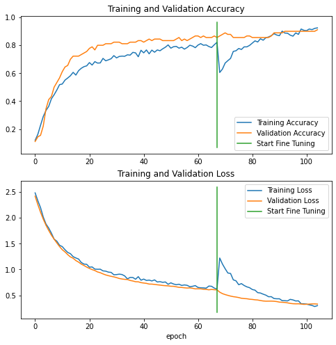
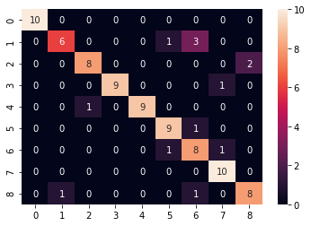
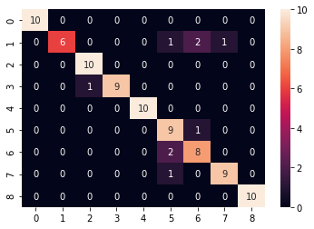
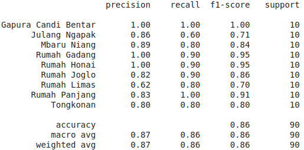
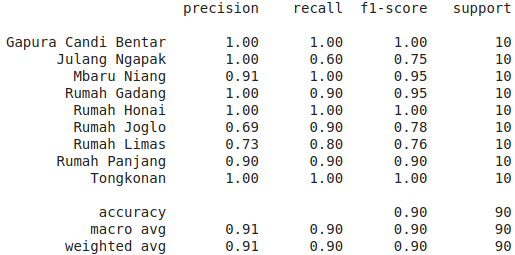

# Traditional House Classification in Indonesia

## Introduction
This is Machine Learning Notebook Research to Classify Traditional House in Indonesia using MobileNetV2 Architecture. 
<b>This Research Funded by HIT (Hibah Integrasi Tridharma).</b>

## Workflows to Build Model
1. Collect Data on Google Image
2. Cleaning Data and Data Preprocessing
3. Data Augmentation
4. Build an Custom Architecture base on MobileNetV2
5. Training with Freeze Model
6. Continue Training with UnFreeze Model (Fine Tuning)
7. Saved and Evaluate The Model

## Result
1. <b>Training History:</b>

    

2. <b>Confusion Matrix:</b>
    - Before Fine Tuning:

        
    
    - After Fine Tuning:
    
        

3. <b>Evaluate with F1-Score:</b>
    - Before Fine Tuning:

        
    
    - After Fine Tuning:
    
        

### Paper Link : (Will be Update After Published as Journal)
